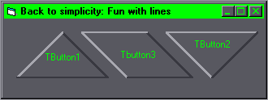

## Back to simplicity: Fun with lines

### Description

Yet another lame installment of simple effects.. this one uses lines and labels to simulate a button of different shapes.. i believe ive commented it enough for basic understanding (not like its complicated). So check it out, leave a flame, and have a coke and a smile..... ;)
 
### More Info
 
Assuming you have a computer, VB installed, and have more or less aquired basic reading/writing skills,

you should be all set.

Although i've labeled this as VB6 code,

it should work in other versions, provided

that you edit the retained line..

A sense of pride and self-satisfaction to know that you're better than i am.

You might devolope a psycological condition from

your unresolved hate towards me, but the acutal

risk is quite minimal.. just breathe deeply,

count to 10 and leave a nasty message, i'm sure

it will pass... ;)

             |
---                |---
**Submitted On**   |2000-07-29 08:37:16
**By**             |[^DaRk^](https://github.com/Planet-Source-Code/PSCIndex/blob/master/ByAuthor/dark.md)
**Level**          |Beginner
**User Rating**    |4.3 (13 globes from 3 users)
**Compatibility**  |VB 6\.0
**Category**       |[Custom Controls/ Forms/  Menus](https://github.com/Planet-Source-Code/PSCIndex/blob/master/ByCategory/custom-controls-forms-menus__1-4.md)
**World**          |[Visual Basic](https://github.com/Planet-Source-Code/PSCIndex/blob/master/ByWorld/visual-basic.md)
**Archive File**   |[CODE\_UPLOAD83257292000\.zip](https://github.com/Planet-Source-Code/dark-back-to-simplicity-fun-with-lines__1-10185/archive/master.zip)

